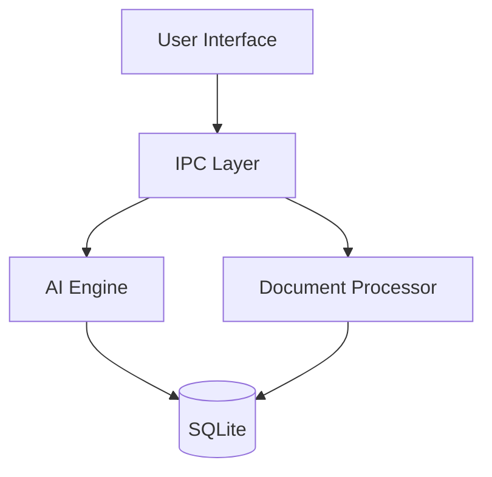

# Architecture

## System Overview

HomeWise AI is built as a desktop application using Tauri (Rust) for the backend and React (TypeScript) for the frontend. The architecture emphasizes privacy, performance, and local processing.

## Core Components

### 1. Frontend Layer (React + TypeScript)

```
src/
├── components/        # UI components
│   ├── chat/         # Chat interface
│   ├── document/     # Document viewer
│   └── common/       # Shared components
├── hooks/            # React hooks
├── store/            # State management
└── utils/            # Utility functions
```

### 2. Backend Layer (Rust + Tauri)

```
src-tauri/
├── src/
│   ├── ai/          # AI processing
│   │   ├── model/   # Model management
│   │   └── inference/# Inference engine
│   ├── document/    # Document processing
│   ├── ipc/         # IPC commands
│   └── db/          # SQLite integration
```

## Key Subsystems

### 1. AI Engine

- Model management and selection
- Hardware detection
- Inference optimization
- Memory management
- Context handling

### 2. Document Processing

- File format support
- Content extraction
- Indexing and search
- Metadata management
- OCR capabilities

### 3. Data Storage

- SQLite database
- File system integration
- Cache management
- Search indexing

## Data Flow



## Security Model

### Data Protection

- Local-only processing
- Encrypted storage
- Secure IPC
- Access control

### Privacy

- No external calls
- Local model inference
- Data isolation
- Secure storage

## Performance

### Resource Management

- Dynamic model loading
- Memory optimization
- Batch processing
- Cache management

### Concurrency

- Parallel processing
- Async operations
- Thread pooling
- Task scheduling

## Cross-Platform Support

### macOS

- Native UI integration
- Metal acceleration
- App sandboxing
- Notarization

### Windows

- Native UI integration
- CUDA support
- Windows security
- Installer support

## Development Architecture

### Build System

- Vite for frontend
- Rust toolchain
- Cross-platform builds
- Asset bundling

### Testing

- Unit testing
- Integration testing
- Performance testing
- Security testing

## Deployment

### Distribution

- Platform-specific packages
- Auto-updates
- Crash reporting
- Analytics (opt-in)
