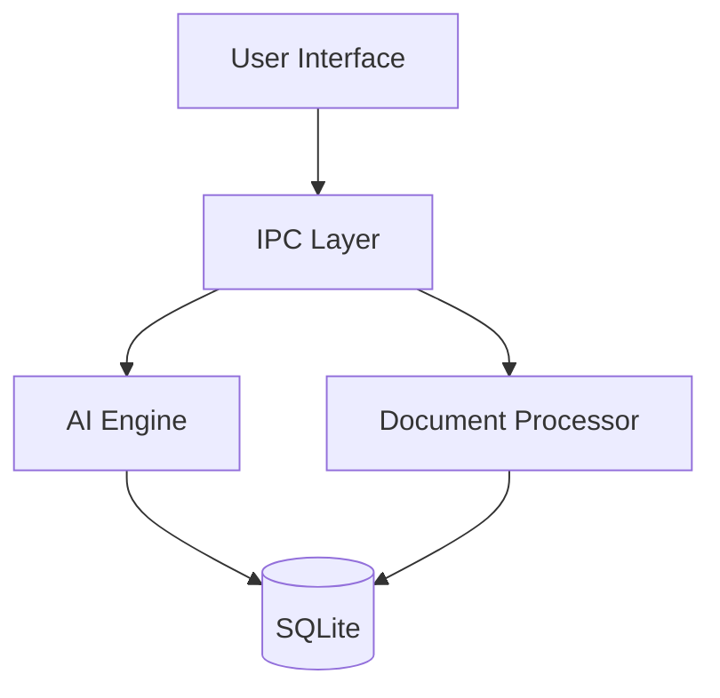

# Architecture

## System Overview

HomeWise AI is built as a desktop application using Tauri (Rust) for the backend and React (TypeScript) for the frontend. The architecture emphasizes privacy, performance, and local processing.

## Core Components

### 1. Frontend Layer (React + TypeScript)

```
src/
├── components/        # UI components
│   ├── chat/         # Chat interface
│   ├── document/     # Document viewer
│   └── common/       # Shared components
├── hooks/            # React hooks
├── store/            # State management
└── utils/            # Utility functions
```

### 2. Backend Layer (Rust + Tauri)

```
src-tauri/
├── src/
│   ├── ai/          # AI processing
│   │   ├── model/   # Model management
│   │   └── inference/# Inference engine
│   ├── document/    # Document processing
│   ├── ipc/         # IPC commands
│   └── db/          # SQLite integration
```

## Key Subsystems

### 1. AI Engine

The AI Engine is responsible for processing AI-related tasks within HomeWise AI. It encompasses the following functionalities:

- **Model Management and Selection:** This involves managing the lifecycle of AI models used by the application, including loading, unloading, and updating models. The system selects the appropriate model based on the user's task and available resources.
- **Hardware Detection and Utilization:** The engine detects the available hardware resources, such as CPU and GPU, and optimizes AI tasks to leverage these resources effectively. This includes utilizing hardware acceleration technologies like Metal on macOS and CUDA on Windows where available.
- **Inference Optimization:** Techniques are employed to optimize the inference process for speed and efficiency. This may include model quantization, pruning, and other optimization strategies to ensure fast response times while maintaining accuracy.
- **Memory Management:** Efficient memory management is crucial for running AI models locally. The engine includes mechanisms for managing memory usage, such as dynamically loading and unloading models and managing intermediate data.
- **Context Handling:** The AI Engine manages the context for AI tasks, allowing for more coherent and relevant responses. This involves maintaining and utilizing conversation history and other relevant information.

### 2. Document Processing

The Document Processing subsystem handles the ingestion, processing, and indexing of documents within HomeWise AI. It includes the following capabilities:

- **File Format Support:** The application supports a variety of common document formats, such as PDF, DOCX, and plain text files. This allows users to work with their existing documents seamlessly.
- **Content Extraction:** This involves extracting the textual content from various document formats. Techniques used may include parsing structured formats and utilizing libraries for more complex formats like PDF and DOCX.
- **Indexing and Search:** Extracted content is indexed to enable efficient searching. The system likely uses an indexing mechanism that supports full-text search and allows users to quickly find information within their documents.
- **Metadata Management:** The system manages metadata associated with documents, such as title, author, and creation date. This metadata can be used for organizing and searching documents.
- **OCR Capabilities:** Optical Character Recognition (OCR) is implemented to extract text from image-based documents or scanned PDFs. This allows the application to process and index content from a wider range of document types.

### 3. Data Storage

- SQLite database
- File system integration
- Cache management
- Search indexing

## Data Flow



## Security Model

HomeWise AI is designed with a strong focus on security and user privacy. The following measures are implemented:

### Data Protection

- **Local-only Processing:** All document processing and AI inference occur locally on the user's machine. This ensures that sensitive data does not need to be transmitted to external servers.
- **Encrypted Storage:** Sensitive data, such as user settings and potentially indexed document content, is stored using encryption. This protects data at rest from unauthorized access.
- **Secure IPC:** Communication between the frontend and backend layers utilizes secure Inter-Process Communication (IPC) mechanisms provided by Tauri. This ensures the integrity and confidentiality of data exchanged between these layers.
- **Access Control:** The application implements access control mechanisms to protect sensitive resources and prevent unauthorized actions.

### Privacy

- **No External Calls:** The application is designed to function entirely offline, without making any calls to external servers for core functionality. This prevents data from being inadvertently shared.
- **Local Model Inference:** AI models are run locally on the user's machine, eliminating the need to send data to external AI inference services.
- **Data Isolation:** User data is isolated within the application's storage and is not shared with other applications or users.
- **Secure Storage:** User data is stored securely on the local file system, with appropriate permissions to prevent unauthorized access from other applications.

## Performance

### Resource Management

- Dynamic model loading
- Memory optimization
- Batch processing
- Cache management

### Concurrency

- Parallel processing
- Async operations
- Thread pooling
- Task scheduling

## Cross-Platform Support

### macOS

- Native UI integration
- Metal acceleration
- App sandboxing
- Notarization

### Windows

- Native UI integration
- CUDA support
- Windows security
- Installer support

## Development Architecture

### Build System

- Vite for frontend
- Rust toolchain
- Cross-platform builds
- Asset bundling

### Testing

- Unit testing
- Integration testing
- Performance testing
- Security testing

## Deployment

### Distribution

- Platform-specific packages
- Auto-updates
- Crash reporting
- Analytics (opt-in)
