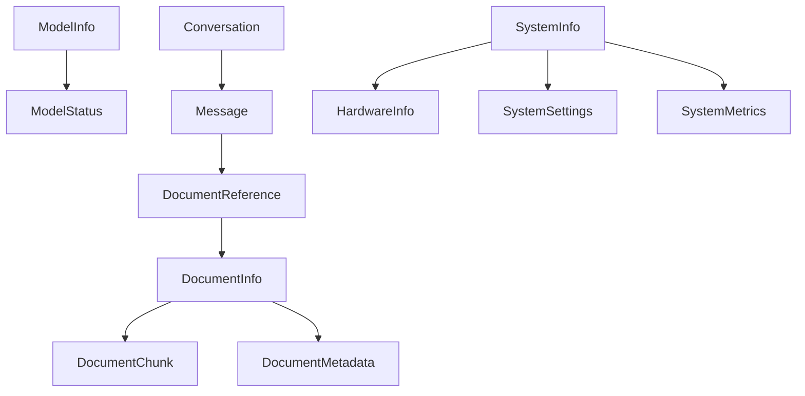

# Data Model

## Core Data Structures

### AI Models

```typescript
interface ModelInfo {
  id: string
  name: string
  version: string
  format: 'gguf' | 'onnx' | 'pytorch'
  size: number
  hash: string
  capabilities: ModelCapability[]
  requirements: {
    minMemory: number
    preferredMemory: number
    gpuRequired: boolean
    minGpuMemory?: number
    minCpuCores?: number
  }
  metadata: {
    description?: string
    parameters?: number
    quantization?: string
    license?: string
    source?: string
  }
}

type ModelCapability = 'chat' | 'completion' | 'embedding' | 'summarization' | 'classification'

interface ModelStatus {
  id: string
  state: 'downloading' | 'processing' | 'ready' | 'error'
  progress?: number
  error?: string
  lastUsed: Date
  metrics?: {
    tokensPerSecond: number
    memoryUsage: number
    gpuMemoryUsage?: number
  }
}
```

### Documents

```typescript
interface DocumentInfo {
  id: string
  path: string
  name: string
  type: DocumentType
  size: number
  created: Date
  modified: Date
  accessed: Date
  hash: string
  metadata: DocumentMetadata
}

type DocumentType =
  | 'text/plain'
  | 'text/markdown'
  | 'application/pdf'
  | 'application/msword'
  | 'application/vnd.openxmlformats-officedocument.wordprocessingml.document'
  | 'application/vnd.apple.pages'
  | 'image/jpeg'
  | 'image/png'

interface DocumentMetadata {
  title?: string
  author?: string
  created?: Date
  modified?: Date
  pageCount?: number
  wordCount?: number
  language?: string
  keywords?: string[]
  customMetadata?: Record<string, unknown>
}

interface DocumentChunk {
  id: string
  documentId: string
  content: string
  index: number
  embedding?: Float32Array
  metadata?: {
    pageNumber?: number
    section?: string
    context?: string
  }
}
```

### Chat

```typescript
interface Conversation {
  id: string
  title?: string
  created: Date
  updated: Date
  messages: Message[]
  context?: {
    documents?: string[]
    settings?: ConversationSettings
  }
}

interface Message {
  id: string
  conversationId: string
  role: 'user' | 'assistant' | 'system'
  content: string
  timestamp: Date
  metadata?: {
    tokens?: number
    processingTime?: number
    documentReferences?: DocumentReference[]
  }
}

interface DocumentReference {
  documentId: string
  chunkId: string
  relevance: number
  context: string
}

interface ConversationSettings {
  temperature: number
  maxTokens: number
  topP: number
  presencePenalty: number
  frequencyPenalty: number
}
```

### System

```typescript
interface SystemInfo {
  hardware: HardwareInfo
  settings: SystemSettings
  metrics: SystemMetrics
}

interface HardwareInfo {
  cpu: {
    cores: number
    threads: number
    model: string
    features: string[]
  }
  memory: {
    total: number
    available: number
  }
  gpu?: {
    name: string
    memory: number
    cuda?: {
      version: string
      cores: number
    }
    metal?: {
      version: string
    }
  }
  storage: {
    total: number
    available: number
  }
}

interface SystemSettings {
  model: {
    preferredFormat: 'gguf' | 'onnx' | 'pytorch'
    maxMemoryUsage: number
    maxGpuMemoryUsage?: number
    useGpu: boolean
  }
  documents: {
    maxFileSize: number
    supportedTypes: DocumentType[]
    indexingStrategy: 'immediate' | 'background' | 'manual'
  }
  interface: {
    theme: 'light' | 'dark' | 'system'
    language: string
    fontSize: number
  }
}

interface SystemMetrics {
  cpu: {
    usage: number
    temperature?: number
  }
  memory: {
    used: number
    cached: number
  }
  gpu?: {
    usage: number
    memoryUsed: number
    temperature?: number
  }
  storage: {
    read: number
    write: number
  }
}
```

## Relationships



## Validation Rules

### Model Validation

```typescript
const modelValidation = {
  size: {
    min: 1024 * 1024, // 1MB minimum
    max: 100 * 1024 * 1024 * 1024, // 100GB maximum
  },
  requirements: {
    minMemory: {
      min: 1024 * 1024 * 1024, // 1GB minimum
    },
    minCpuCores: {
      min: 1,
      max: 128,
    },
  },
}
```

### Document Validation

```typescript
const documentValidation = {
  size: {
    max: 1024 * 1024 * 1024, // 1GB maximum
  },
  chunk: {
    size: {
      min: 100, // 100 characters minimum
      max: 2000, // 2000 characters maximum
    },
  },
}
```

### Chat Validation

```typescript
const chatValidation = {
  message: {
    content: {
      max: 32000, // Maximum characters
    },
  },
  conversation: {
    messages: {
      max: 1000, // Maximum messages per conversation
    },
  },
}
```
